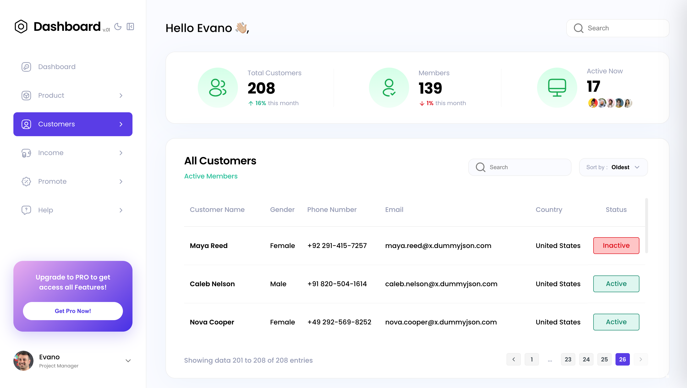
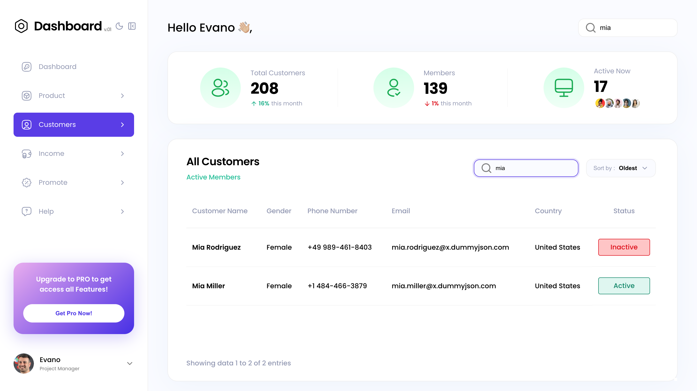
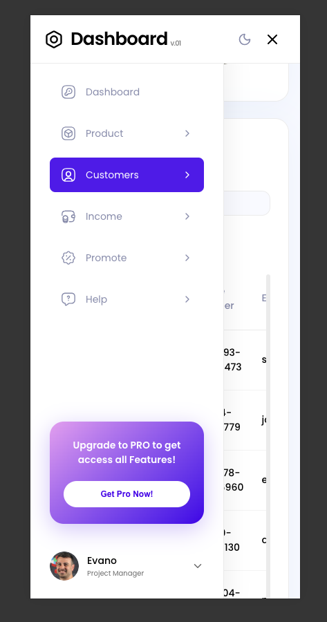
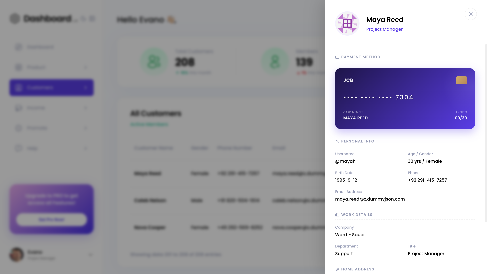
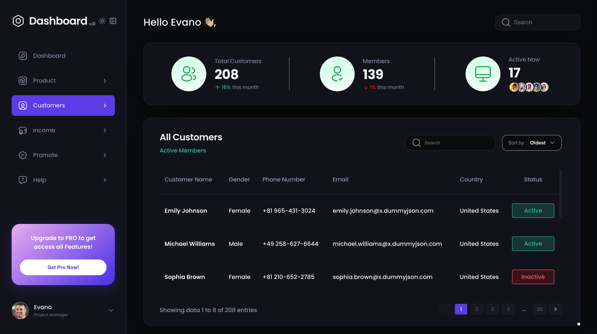
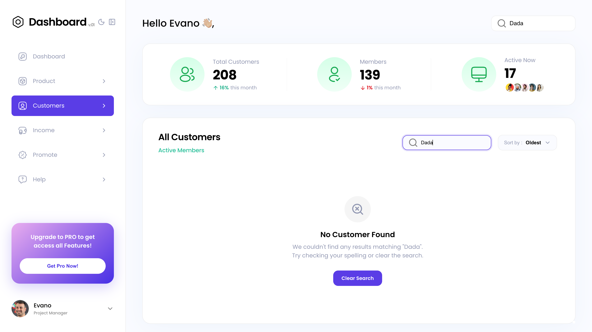
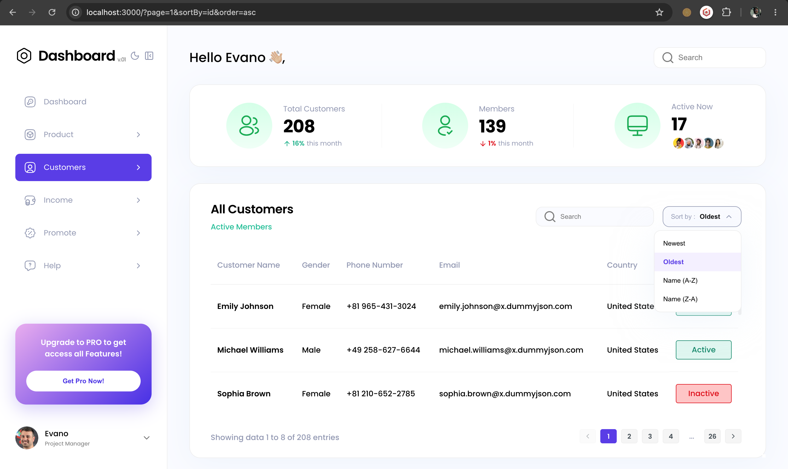
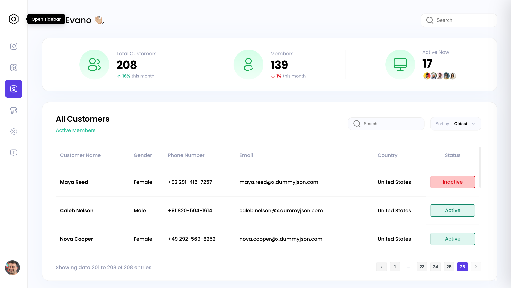

# Customers Dashboard

A responsive customer management dashboard built as part of a technical take-home assessment. The application uses data from the public DummyJSON Users API and relies on URL parameters to handle search, sorting, pagination, and user details, creating a smooth and intuitive user experience.

---

## Live Demo

- **GitHub Repository**: [Link to Repository](https://github.com/Laitandada/customer-dashboard)
- **Production URL**: [Link to Live Site](https://customer-dashboard-laitandadas-projects.vercel.app/)

---

## Tech Stack

This project is built from the ground up using a modern, type-safe stack designed for performance, maintainability, and clean layout reconciliation:

- **Framework**: [Next.js v16.2 (App Router)](https://nextjs.org/) — Utilizing Server Components, Server-Side Data Fetching, streaming, and loading skeletons.
- **Language**: [TypeScript](https://www.typescript.org/) — Strict typing applied across components, API schemas, and component prop structures.
- **Library**: [React v19.2](https://react.dev/) — Taking advantage of Server/Client component separation, Transitions, and state hooks.
- **Styling**: **Vanilla CSS Modules** — Pure CSS selectors scoped at the component level to prevent global namespace pollution, maintaining light/dark theme variables, transitions, and media queries.
- **Icons**: [Lucide React](https://lucide.dev/) — High-quality SVG icons for interactive UI elements.
- **Utility / UI Libraries**: None. All components, dropdowns, themes, modals, and pagination components are fully custom-built to keep the bundle footprint minimal.

---

# User Dashboard

## Desktop View



## Search Feature



## Mobile View



## User Details Drawer



## Dark Mode



## No Searched Result



## Sorting (Ascending & Descending)



## Closed Sidebar



---

## Features Implemented

- [x] **App Router (not Pages Router)**: Built entirely on `src/app/` — every route, layout, loading state, and error boundary uses App Router file conventions.
- [x] **Server Components by default**: The component tree defaults to Server Components. `"use client"` is only added at the specific interactive leaf where it is genuinely required.
- [x] **Server-side data fetching — no `useEffect`**: All data (user list, total count, avatars) is fetched in an `async` Server Component via `Promise.all`. No client-side fetch hooks are used for initial data loading.
- [x] **URL-driven state**: Search (`q`), pagination (`page`), sort field (`sortBy`) and direction (`order`) are all read from `searchParams` on the server. Client components update the URL via `router.push()` — state is server-renderable and shareable.
- [x] **`loading.tsx` skeleton**: A pixel-matched skeleton screen that Next.js streams immediately while `page.tsx` awaits its fetches. Zero layout shift on data arrival.
- [x] **`<Suspense>` boundaries with streaming**: `SearchInput`, `SortDropdown`, and `Pagination` are each wrapped individually in `<Suspense>` — they hydrate independently without blocking the rest of the page.
- [x] **Deliberate `fetch` caching with `revalidate`**: Each fetch uses `{ next: { revalidate: 300 } }`. The trade-off (freshness vs. performance) is documented below.
- [x] **Debounced search with transition indicator**: 400ms debounce + `useTransition` keeps the input responsive. An animated spinner replaces the search icon during server round-trips.
- [x] **Custom sorting dropdown**: Built from scratch — dropdown open state, click-outside detection via `useRef`, animated transitions.
- [x] **SEO-friendly pagination**: Uses Next.js `<Link>` elements so every paginated state is crawlable and deep-linkable.
- [x] **Slide-out customer detail drawer**: Row click opens a right-hand panel with avatar, personal info, employer, address, and a styled masked credit card graphic.
- [x] **Error boundary (`error.tsx`)**: Catches API failures and renders a retry screen without a full page reload.
- [x] **Empty state**: Zero-result searches render a descriptive message and a "Clear Search" link — not a blank table.
- [x] **Light/Dark theme engine**: CSS variable swap driven by a sidebar toggle, persisted in `localStorage`.

---

## Architecture & Folder Structure

### App Router — Not Pages Router

This project is built exclusively on the **Next.js App Router** (`src/app/` directory). There is no `pages/` directory in this codebase. Every route, layout, loading state, and error boundary is defined using App Router file conventions (`layout.tsx`, `page.tsx`, `loading.tsx`, `error.tsx`).

### Folder Tree

```text
src/
├── app/
│   ├── error.tsx           # Error boundary — catches API failures and renders a retry screen
│   ├── globals.css         # Design token CSS variables (colors, spacing, shadows, transitions)
│   ├── layout.module.css   # Top-level app shell grid (sidebar + main content)
│   ├── layout.tsx          # Root Server Component layout — loads Poppins font, renders Sidebar
│   ├── loading.tsx         # Streaming skeleton — shown instantly while page.tsx fetches data
│   └── page.tsx            # Async Server Component — all data fetching lives here
├── components/
│   ├── drawer.module.css   # Styles for slide-out drawer backdrop, panel, and credit card graphic
│   ├── Pagination.tsx      # "use client" — reads URL params, pushes updated page numbers
│   ├── SearchInput.tsx     # "use client" — debounced input, useTransition, loading spinner
│   ├── Sidebar.tsx         # "use client" — localStorage theme toggle, minimize state
│   ├── sidebar.module.css  # Styles for navigation and dark mode toggle
│   ├── SortDropdown.tsx    # "use client" — dropdown open state, click-outside ref
│   ├── StatsCards.tsx      # Server Component — pure render of stats passed as props
│   ├── stats.module.css    # Card widget grids
│   ├── UserDrawer.tsx      # "use client" — drawer open/close state, Escape key listener
│   ├── UserTable.tsx       # "use client" — row click handler, selected user state
│   └── table.module.css    # Customer table grid, status pill, and row hover styles
```

### Server Components vs. Client Components — Intentional Boundaries

The default in this project is **Server Component**. The `"use client"` directive is only added where the browser environment or interactivity is genuinely required. Every decision is intentional:

| Component          | Directive      | Reason                                                          |
| ------------------ | -------------- | --------------------------------------------------------------- |
| `layout.tsx`       | Server         | Pure shell, no interaction needed                               |
| `page.tsx`         | Server         | `async` data fetching with `await fetch(...)`                   |
| `StatsCards.tsx`   | Server         | Receives props, renders static markup                           |
| `SearchInput.tsx`  | `"use client"` | Needs `useState`, `useEffect`, `useTransition`, `useRouter`     |
| `SortDropdown.tsx` | `"use client"` | Dropdown open/close state, `useRef` for click-outside detection |
| `Pagination.tsx`   | `"use client"` | Reads `useSearchParams()` to construct page URLs                |
| `UserTable.tsx`    | `"use client"` | Row click state (`selectedUser`), drawer open/close             |
| `UserDrawer.tsx`   | `"use client"` | Keyboard listener, body scroll lock, animation state            |
| `Sidebar.tsx`      | `"use client"` | `localStorage` access for theme persistence                     |

The Server/Client boundary is deliberately placed **at the leaf level** — Server Components handle layout and data passing; only the specific interactive leaf components opt into the client bundle.

---

## Server-Side Data Fetching Strategy

### All Fetching Happens on the Server — No `useEffect`

All data fetching occurs in [`src/app/page.tsx`](./src/app/page.tsx), which is an **async Server Component**. Three API calls run concurrently via `Promise.all`, resolving before the component renders:

```typescript
// src/app/page.tsx
export default async function Home({ searchParams }: PageProps) {
  const params = await searchParams;

  const [usersRes, totalDbRes, avatarsRes] = await Promise.all([
    fetch(usersApiUrl, { next: { revalidate: 300 } }),
    fetch("https://dummyjson.com/users?limit=0", { next: { revalidate: 300 } }),
    fetch("https://dummyjson.com/users?limit=5", { next: { revalidate: 300 } }),
  ]);
  // ...pass resolved data down to components as props
}
```

`useEffect` for data fetching was intentionally avoided. A `useEffect`-based approach forces a **client-side waterfall**: the browser loads the JS bundle → mounts the component → fires the hook → waits for the API → re-renders. The user sees a blank or spinner state on every load. Fetching on the server means the HTML arrives fully populated on the first byte.

### URL Search Params as the Single Source of Truth

Rather than `useState` for filters, all application state lives in the URL. The server reads `searchParams` on every request and passes resolved values down as props:

```typescript
const search = typeof params.q === "string" ? params.q : "";
const page = Number(params.page) || 1;
const sortBy = typeof params.sortBy === "string" ? params.sortBy : "id";
const order = typeof params.order === "string" ? params.order : "desc";
```

This means the application state is **fully server-renderable and shareable via URL**:

| Action                 | Resulting URL                                |
| ---------------------- | -------------------------------------------- |
| Navigate to page 2     | `/?page=2`                                   |
| Search for a user      | `/?q=john`                                   |
| Sort ascending by name | `/?sortBy=firstName&order=asc`               |
| Combined               | `/?q=john&page=2&sortBy=firstName&order=asc` |

When a client component updates a filter (e.g. `SearchInput` calls `router.push()`), Next.js re-runs the Server Component with the updated `searchParams`, fetches fresh data, and streams the result — no client-side state management library required.

---

## Caching Strategy & Reasoning

All three `fetch` calls use Next.js's extended `{ next: { revalidate: 300 } }` option:

```typescript
fetch(usersApiUrl, { next: { revalidate: 300 } });
```

### The Decision: ISR-style Revalidation at 5 Minutes

Three alternatives were considered:

| Option               | Behaviour                                  | Decision                                                                                                 |
| -------------------- | ------------------------------------------ | -------------------------------------------------------------------------------------------------------- |
| `cache: 'no-store'`  | Bypass cache entirely — always fetch fresh | ❌ Every pagination or search click hits the DummyJSON API — unnecessary latency for low-volatility data |
| `force-cache`        | Cache indefinitely until redeployment      | ❌ Customer records do change; stale data with no refresh path is not acceptable                         |
| `revalidate: 300` ✅ | Serve from cache, re-fetch after 5 min     | ✅ Right balance for a customer dashboard context                                                        |

With `revalidate: 300`, repeat requests within the window are served from Next.js's server cache in milliseconds. After 5 minutes, the next request triggers a background re-fetch. Crucially, each unique URL signature (`/?q=john&page=1` vs `/?q=emily&page=1`) is a **separate cache entry** — searches are cached independently without colliding.

---

## Loading, Error, and Empty States

- **Loading Skeletons (`loading.tsx`)**: When a route transition occurs, Next.js streams the loading fallback immediately. The skeleton uses CSS grid items and pulse animations to mirror the actual table structure, avoiding sudden page jumps.
- **Error Boundaries (`error.tsx`)**: If the API goes down or fails to respond (e.g. rate-limiting), the error boundary intercepts the exception, displaying an diagnostic screen with descriptive details and a "Try Again" recovery action.
- **Clean Empty States (`UserTable.tsx`)**: If a query returns no matches, the interface renders a "User does not exist" dashboard layout rather than crashing or showing a raw empty page. It includes a link to clear filters.

---

## Assumptions & Trade-offs

- **User Status Field**: The DummyJSON API does not return a `status` field. To keep the statuses consistent across page filtering, sorting, and pagination, we derived it deterministically in the table (`id % 3 !== 0 ? 'Active' : 'Inactive'`).
- **CSS Transitions in RSC**: Managing animations in a Next.js Server Component context requires careful placement of Client boundaries. We converted `UserTable` to a Client Component to manage drawer slide states and trigger animation keyframes.
- **API Search Limitations**: The DummyJSON `/users/search` endpoint only supports filtering by name. Multi-column query support (sorting by phone, email, or country) was handled within the bounds of the API schema structure.

---

## Responsive Design

- **Mobile First**: Layout is designed mobile-first and expanded for larger screens.
- **Breakpoints**:
  - **1200px**: Larger cards, icon spacing.
  - **1024px**: Sidebar hides on mobile, search input moves to top bar.
  - **768px**: Stack cards vertically, hide sidebar.

---

## What I Would Improve With More Time

1. **Enhanced Keyboard Navigation**: Add comprehensive keyboard accessibility (arrow keys for sorting list selections, tab indexing inside the slide-out drawer).
2. **End-to-End Testing**: Set up Playwright tests to cover search typing debounces, pagination navigation, sorting criteria changes, and drawer close gestures.
3. **Dedicated Data Access Layer**: Extract API requests and data transformation logic into a dedicated `services/` or `lib/api/` directory. This would centralize communication with external APIs, improve reusability, and make it easier to swap the DummyJSON endpoints for a production backend in the future while keeping Server Components focused on rendering.
4. **Advanced Analytics Dashboard**: Enhance the dashboard with charts and graphs to visualize customer data and trends.
5. **Centralized Type Definitions**: Consolidate shared TypeScript interfaces, API response types, and component props into a dedicated `types/` directory. This would improve maintainability, reduce duplication across components, and make it easier to evolve the data model as the application grows.

---

## AI Usage Disclosure

AI tools were used throughout the development process to speed up implementation, assist with styling, and help debug issues around React Server Components and App Router patterns. However, all architectural decisions—including the server-side data-fetching strategy, URL-driven state management, component structure, and overall implementation—were made, reviewed, and finalized by me.

---

## Time Spent

Approximately 8 hours

---

## Running Locally

Follow these instructions to clone, install, and run the project locally.

### Prerequisites

Ensure you have [Node.js](https://nodejs.org/) (version 18.17.0 or higher recommended) and [npm](https://www.npmjs.com/) installed.

### Setup Instructions

1. **Clone the repository**:

   ```bash
   git clone <repository-url>
   cd <repository-folder>
   ```

2. **Install dependencies**:

   ```bash
   npm install
   ```

3. **Start the development server**:

   ```bash
   npm run dev
   ```

4. **Open the browser**:
   Navigate to [http://localhost:3000](http://localhost:3000) to view the customer dashboard.

---
